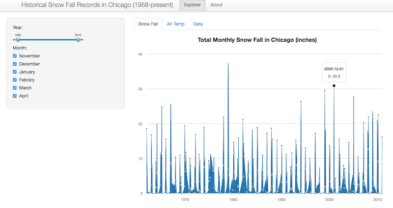

---
title       : Historical Snow Fall in Chicago US
subtitle    : Developing Data Product Project
author      : Helen Huang
job         : 
framework   : io2012        # {io2012, html5slides, shower, dzslides, ...}
highlighter : highlight.js  # {highlight.js, prettify, highlight}
hitheme     : tomorrow      # 
widgets     : [bootstrap, interactive]            # {mathjax, quiz, bootstrap}
ext_widgets : {rCharts: [libraries/morris]}
mode        : selfcontained # {standalone, draft, selfcontained}


--- # Introduction and objectives

## Executive summary

As winter months in Chicago linger from Nov to April, snow is a serious weather event and can present challenges to the local residents and the authorities. 

This simple, **interactive** app provides an unique opportunity for the viewers to search for historical snow falls in Chicago winter from Nov, 1958 till Nov, 2014. 

Total monthly snow falls (inches) and concurrent average monthly air temperature (as max temp, min temp and average temp, F) are analyzed . 

Searchable information are displayed as 'Snow Fall' graph, 'Air Temp' graph and also summarized in table output format under 'Data' tab. 

(Data source: National Oceanic and Atmospheric Administration, NOAA, HTTP://WWW.nova.gov).

--- #shiny app

## Preview of 'Historical Chicago Snow Fall' app





**This is the link to the shiny app:  http://helenhh.shinyapps.io/chicagoSnowApp.**


--- #snow plot

## Total Monthly Snow Fall in Chicago (1958-present)

Display the snow fall records by selecting year/month in the sidebar or hovering the mouse cursor over the graph in the app.

```{r, s1, echo = FALSE, fig.height = 6, fig.width=10, fig.align = 'center', message = F, results = 'asis'} 

require(ggplot2)
dat <- read.csv("NORR.csv")
df1 <- subset(dat[, c("Date", "Snow.Fall")])
df5 <- transform(df1, Date = as.POSIXct(strptime(df1$Date, format = "%Y%m%d")))

plot(df5$Date, df5$Snow.Fall, type= "l", xlab= "Year", ylab = "Snow fall (inches)", cex.lab=1.2, cex.axis=1.0, col="blue")

```

--- #temp plot and conclusion

## Average Monthly Temp in Chicago (1958-present)

```{r, s2, echo = FALSE, fig.height = 5, fig.width=12, fig.align = 'center', message = F, results = 'asis'}
require(ggplot2)
require(reshape2)
#Temp
dat <- read.csv("NORR.csv")
tmp <- subset(dat[, c("Date", "Temp.Max","Temp.Min", "Temp.Mean")])
tmp1 <- transform(tmp, Date = as.character(strptime(tmp$Date, format = "%Y%m%d")))
tmp2 = melt(tmp1, id = "Date")
tmp2$Date <- as.POSIXct(tmp2$Date)
colnames(tmp2) <- c("Date", "variable", "Temp")

ggplot(tmp2, aes(x = Date, y = Temp, group = variable, 
    colour = variable)) +
    geom_line() +
    ylab('Temperture(F)') +
    geom_point() +
    theme_bw() +
    scale_fill_discrete(name="",
                         breaks=c("Temp.Max","Temp.Min", "Temp.Mean"),
                         labels=c("Temp.Max","Temp.Min", "Temp.Mean")) +
    theme(legend.position = 'right', legend.title=element_blank()) + 
    theme(axis.title=element_text(size=14))

```

The matching snow fall and air temperature information are also available in table format under 'Data' tab. **The app link is:  http://helenhh.shinyapps.io/chicagoSnowApp.**


